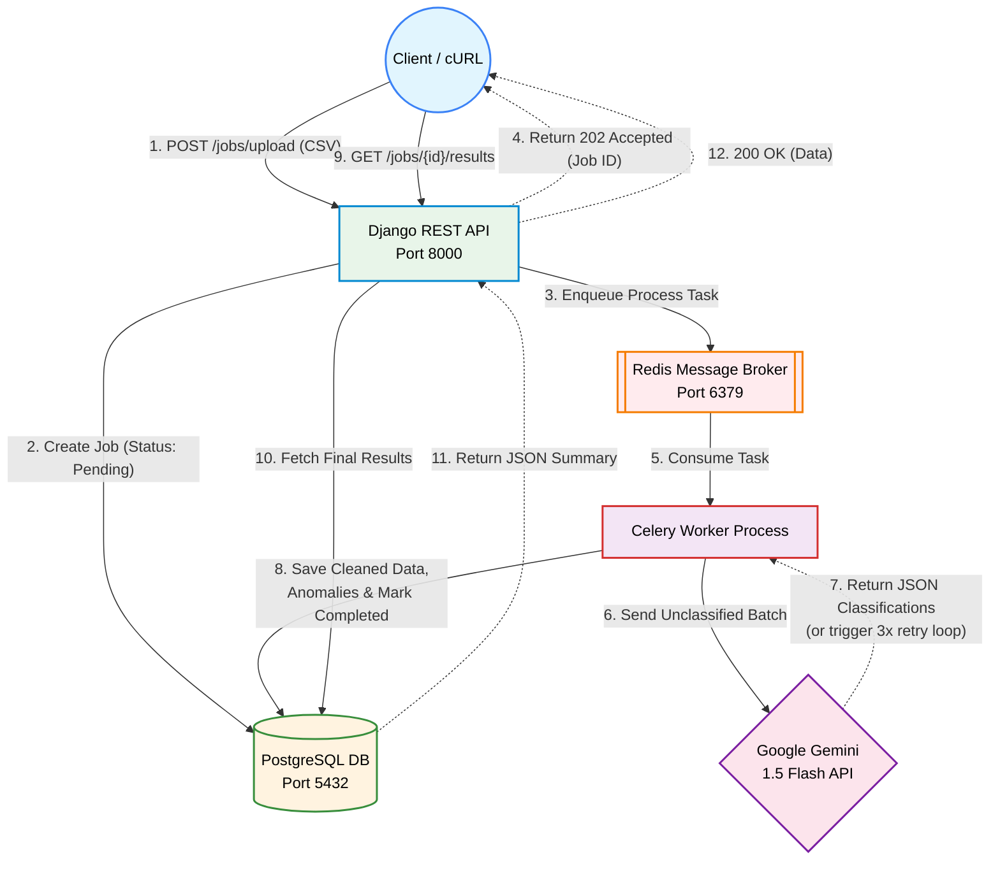

# Alemeno: AI-Powered Transaction Processing Pipeline

This repository contains the backend and DevOps assignment for the Alemeno internship. It is a fully containerized, asynchronous API pipeline designed to process dirty financial data, detect statistical anomalies, and leverage an LLM (Google Gemini) for transaction classification and summarization.

## 🚀 Tech Stack

* **Framework:** Django REST Framework (DRF)
* **Database:** PostgreSQL
* **Asynchronous Task Queue:** Celery
* **Message Broker:** Redis
* **LLM Integration:** Google Gemini 1.5 Flash (via `google-generativeai`)
* **Infrastructure:** Docker & Docker Compose

## 🏗️ Architecture & Data Flow

1. **Client** uploads a CSV via the API.
2. **Django API** creates a Job record in **PostgreSQL** and enqueues the task to **Redis**.
3. **Celery Worker** picks up the task, parses the CSV, cleans the data (ISO 8601 dates, strips currency symbols), and deduplicates rows.
4. **Worker** performs mathematical anomaly detection (flagging amounts > 3x the account median and USD transactions for domestic brands).
5. **Worker** batches unclassified transactions and sends them to the **Gemini API** for categorization.

   * Includes 3-attempt exponential backoff for fault tolerance.
6. **Worker** saves the final cleaned data, anomalies, and summary back to **PostgreSQL**.

## Diagram 


## ⚙️ Setup & Installation

### Prerequisites

* Docker Desktop installed and running.
* A valid Google Gemini API Key.

### 1. Clone the Repository

```bash
git clone https://github.com/pattanayakpratik/AI-Transaction-Processing-assignment-task.git
cd app
```

### 2. Configure Environment Variables

Create a `.env` file in the `app/` directory (where `docker-compose.yml` is located) and add your Gemini API key:

```env
GEMINI_API_KEY=your_actual_api_key_here
```


### 3. Build and Run the Stack

Start the entire infrastructure (PostgreSQL, Redis, Django API, and Celery worker) with a single command:

```bash
docker compose up --build
```

The API will be available at:

```text
http://localhost:8000/
```

---

## 📖 API Documentation & Usage

**Note for Windows users:** If you are using PowerShell, replace `curl` with `curl.exe`.

### 1. Upload a CSV File

Uploads the transaction dataset and immediately returns a Job ID.

**Request**

```bash
curl -X POST http://localhost:8000/jobs/upload -F "file=@../transactions.csv"
```

**Response**

```json
{
  "job_id": 1
}
```

### 2. Check Job Status

Poll this endpoint to check if the background worker has finished processing the job.

**Request**

```bash
curl http://localhost:8000/jobs/1/status
```

**Response (Processing)**

```json
{
  "job_id": 1,
  "status": "processing"
}
```

**Response (Completed)**

```json
{
  "job_id": 1,
  "status": "completed",
  "summary": {
    "total_spend_inr": "1339923.00",
    "total_spend_usd": "74185.14",
    "top_merchants": [
      {
        "merchant": "IRCTC",
        "total": 450697.69
      },
      {
        "merchant": "Jio Recharge",
        "total": 270255.97
      }
    ],
    "anomaly_count": 5,
    "narrative": "...",
    "risk_level": "medium"
  }
}
```

### 3. Fetch Full Results

Retrieves the completely cleaned dataset, flagged anomalies, and LLM classifications.

**Request**

```bash
curl http://localhost:8000/jobs/1/results
```

**Response**

```json
{
  "cleaned_transactions": [...],
  "anomalies": [...],
  "summary": {...}
}
```

### 4. List All Jobs (Optional Filtering)

View a history of all jobs. You can filter by status (`pending`, `processing`, `completed`, `failed`).

**Request**

```bash
curl "http://localhost:8000/jobs?status=completed"
```

---

## 🛡️ Fault Tolerance & Retries

The pipeline implements resilient error handling. If the external Gemini API is unreachable or returns an error (such as a 404 due to SDK versioning), the Celery worker catches the exception, applies a **3-attempt exponential backoff**, and safely marks the specific batch as `llm_failed`.

The worker then gracefully finishes the remaining database operations, ensuring the pipeline never crashes entirely due to third-party outages.

---

## 📈 Scalability Considerations

If traffic scales by 100x, the current architecture will bottleneck at:

* Local disk I/O from saving temporary CSV files.
* Synchronous worker blocking while waiting on LLM API responses.

### Enterprise Iteration

1. Migrate file uploads directly to **AWS S3** via presigned URLs.
2. Upgrade to **AWS RDS PostgreSQL** and utilize **PgBouncer** for connection pooling.
3. Scale Celery workers horizontally across a Kubernetes cluster.
4. Use asynchronous HTTP clients to batch LLM requests in parallel.
